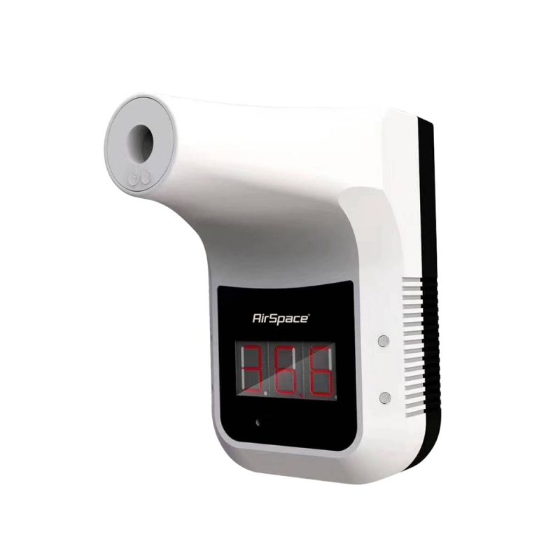
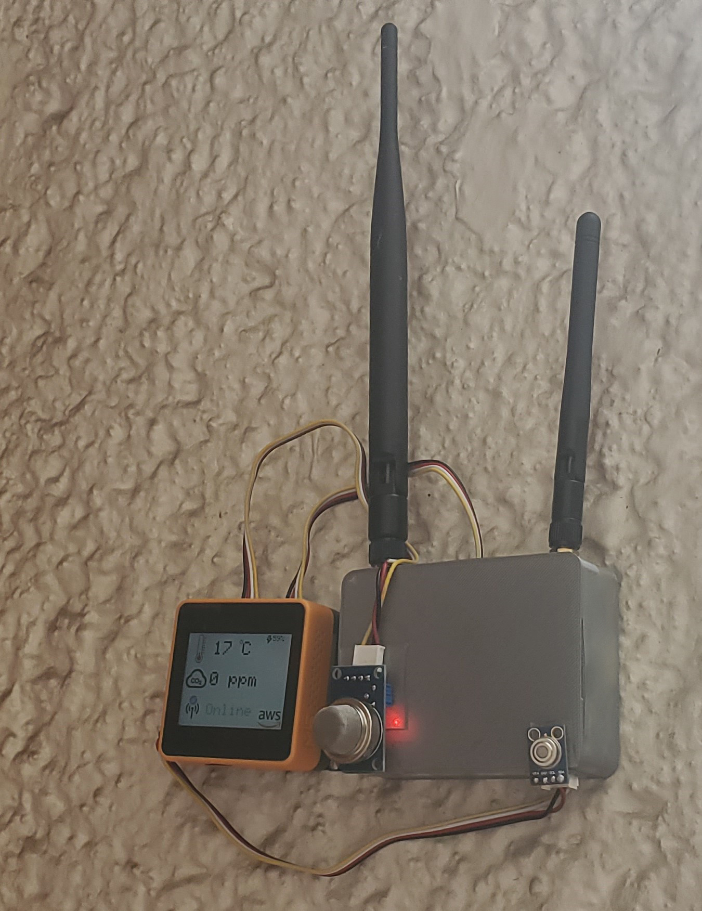
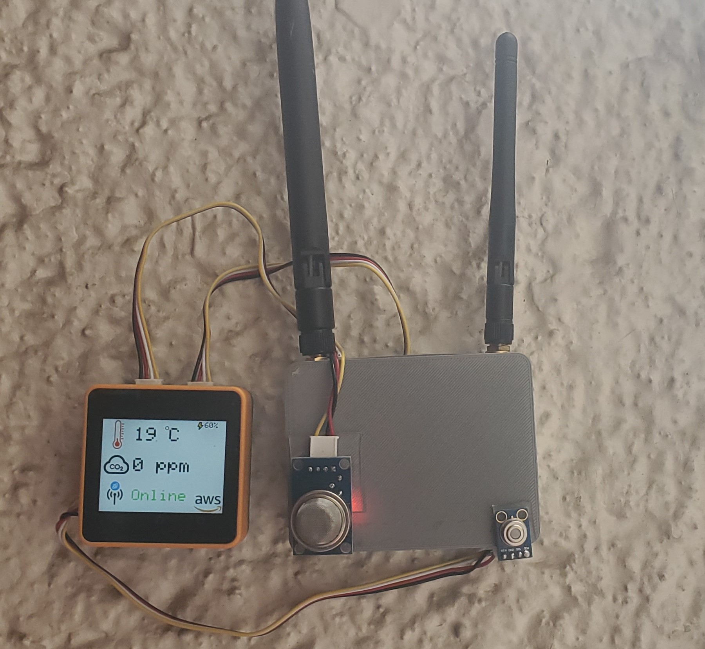

# Healthium
 

# Table of Contents:

- [Healthium](#healthium)
- [Table of Contents:](#table-of-contents)
- [Introduction:](#introduction)
- [Solution:](#solution)
- [Materials:](#materials)
  - [Hardware:](#hardware)
  - [Software:](#software)
  - [Cloud Services:](#cloud-services)
- [Connection Diagram:](#connection-diagram)
  - [Hardware Diagram:](#hardware-diagram)
  - [System Diagram:](#system-diagram)
- [M5 Core2 AWS Setup:](#m5-core2-aws-setup)
  - [PortA:](#porta)
  - [PortB:](#portb)
  - [PortC:](#portc)
    - [Fipy Setup:](#fipy-setup)
      - [Pymakr:](#pymakr)
  - [Results:](#results)
- [AWS:](#aws)
  - [Helium - AWS IoT Integration:](#helium---aws-iot-integration)
  - [AWS IAM Creation:](#aws-iam-creation)
  - [AWS DynamoDB:](#aws-dynamodb)
  - [AWS IoT Rule:](#aws-iot-rule)
  - [WebApp:](#webapp)
    - [ReactJS:](#reactjs)
    - [AWS Lambda:](#aws-lambda)
    - [AWS API Gateway:](#aws-api-gateway)
      - [Test:](#test)
      - [CORS:](#cors)
    - [AWS CodeCommit:](#aws-codecommit)
    - [AWS Amplify:](#aws-amplify)
- [Final Product:](#final-product)
  - [Device:](#device)
  - [WebApp Final:](#webapp-final)
- [EPIC DEMO:](#epic-demo)

# Introduction:

COVID-19 has changed our daily lives and continues to do so. Many retail stores and companies have gone out of business, unable to offer their services to their clients. However some others which have opted for the reopening of their businesses in turn have had to adapt to the times.This includes public institutions such as museums, libraries, etc. All these establishments have taken their precautionary measures, generating new regulations, such as take the temperature at the entrance and maintain good ventilation inside.
 
Given this new environment, businesses have had to create new kinds of jobs or jobs to be done. One of these is to check the temperature of the customers before entering the establishment, risking not only the worker who is checking the temperature of the customers, but also the customers who enter the place.
 
This job generates an annual cost per worker of at least $30, 000 [1] and if that employee were to become ill with covid-19, by law (in the United States) they would have to pay him at least $511 a day [2].
These costs (both monetary and health wise) for an employee who performs a repetitive task is excessive but necessary, because the solutions currently created are not yet sufficient to replace this position.

1. https://www.ziprecruiter.com/Salaries/Retail-Security-Officer-Salary
2. https://www.dol.gov/sites/dolgov/files/WHD/posters/FFCRA_Poster_WH1422_Non-Federal.pdf

# Solution:

This system is capable of not only reading the body temperature of a person through the back of his hand, but also reading the PPM (Air quality) in the environment. This, in order to ensure that customers and employees are in a well-ventilated environment.

Current solutions:

The hand thermometers are intended to obtain a manual reading of body temperature, however these must be taken by a worker all the time and do not keep any records.

Automatic thermometers; these devices automate the task of taking temperature readings, however the customer has to approach their forehead to the device for a reading and like the previous device, all data ends up lost.

My solution integrates all the advantages of temperature measurement and environmental condition of the establishment. It uses both the backend and the frontend services of the AWS cloud. Just by performing the initial setup, since this device is already capable of sending the data through the Helium LoraWAN network, it is not necessary to make any changes or extra investment in the establishment, in addition to being a Plug and Play device.

# Materials:

## Hardware:

1. M5Stack Core2 ESP32 IoT Development Kit for AWS IoT EduKit - [Product Link](https://shop.m5stack.com/collections/stack-series/products/m5stack-core2-esp32-iot-development-kit-for-aws-iot-edukit)
2. Infrared Temperature Sensor - [Product Link](https://www.amazon.com/dp/B071VF2RWM/ref=cm_sw_em_r_mt_dp_KEJ8WFJZ8B0FFXJ1XK6P?_encoding=UTF8&psc=1)
3. MQ135 - [Product Link](https://www.amazon.com/dp/B07L73VTTY/ref=cm_sw_em_r_mt_dp_2PFBGBTKYNTBXT1SCTFS)
4. Pycom Fipy or Lopy - [Product Link](https://pycom.io/product/fipy/)

## Software:

1. Arduino IDE - [Program Link](https://www.arduino.cc/en/software)
2. Arduino M5Core2 Library - [Library Link](https://github.com/m5stack/M5Core2)

## Cloud Services:

1. IoT Core - [Service Link](https://aws.amazon.com/iot-core/)
2. DynamoDb - [Service Link](https://aws.amazon.com/dynamodb/?nc2=type_a)
3. API Gateway - [Service Link](https://aws.amazon.com/api-gateway/?nc2=type_a)
4. Lambda - [Service Link](https://aws.amazon.com/lambda/?nc2=type_a)
5. CodeCommit - [Service Link](https://aws.amazon.com/codecommit/)
6. Amplify - [Service Link](https://aws.amazon.com/amplify/)
7. Helium Account - [Service Link](https://console.helium.com/)

# Connection Diagram:

## Hardware Diagram:

## System Diagram:

# M5 Core2 AWS Setup:

The M5Core2 is an excellent prototype development platform, I took advantage of the external grove ports of the device to be able to connect the sensors necessary for the operation of the [System](#hardware-diagram).

| Port   | GPIO PIN     | GPIO PIN     |
| ------ | ------------ | ------------ |
| Port A | GPIO32(SDA)  | GPIO33(SCL)  |
| Port B | GPIO26(DAC)  | GPIO36(ADC)  |
| Port C | GPIO13(RXD2) | GPIO14(TXD2) |

For more information go to the official documentation. [Link](https://docs.m5stack.com/en/core/core2_for_aws)

ArduinoIDE was used to program the board.

- Arduino IDE - [Program Link](https://www.arduino.cc/en/software)
- Arduino M5Core2 Library - [Library Link](https://github.com/m5stack/M5Core2)

NOTE: the port voltage is 5V, take this into consideration when selecting modules and sensors.

## PortA:

To this pin connect an MLX90614 sensor which works through I2C.

For the correct calculation of the temperature from the hand, the following table was considered as a reference.

To calculate real body temperature, a multivariable linear regression model was performed to obtain an equation that would relate the temperature of the back of the hand and the ambient temperature, to obtain the real internal temperature of the body.

Inside the code this formula is programmed in the following function.

    float correlation(float amb, float skin) {
      if (skin > 27 && skin < 36) {
        float realTemp = 0.71429 * skin - 0.35714 * amb + 23.14286;
        return realTemp;
      }
      return skin;
    }

## PortB:

In this port the MQ135 sensor was placed for its ability to measure air quality (PPM), this through an analog value. Thankfully, as it is an economical module, there is a lot of documentation on how to use this sensor correctly.

[Docs](https://hackaday.io/project/3475-sniffing-trinket/log/12363-mq135-arduino-library)

The library used for this project is the following, for this application I used this library with the Arduino IDE.

[Repository](https://github.com/GeorgK/MQ135)

The part of the code that performs this calculation is the following.

    ...
    #include "MQ135.h"
    ...
    #define RZERO 76.63
    ...
    MQ135 gasSensor = MQ135(36);
    ...
    gSensor = gasSensor.getPPM();

## PortC:

Here we are going to connect the most important module for the project which is the LoraWAN module, made in this case with a Pycom board [Fipy](https://pycom.io/product/fipy/) (you can also use a [Lopy](https://pycom.io/product/lopy4/)).

The first thing we must consider is that this module, unlike the others, does not support 5V in its digital ports, therefore, as shown in the [System](#hardware-diagram) we will have to make a voltage divider to lower the voltage of 5v to 3.3, here is a small simulation of the voltage divider to make its usefulness clearer.

NOTE: Failure to use a voltage divider could permanently damage the Fipy/Lopy.

I placed this circuit on a breadboard and made a shield with it, to avoid failures in the circuit.

### Fipy Setup:

Since we have now covered all the Hardware considerations, we have to configure the Fipy module to transmit the information sent from the M5Core2 to the Helium LoraWAN network. This is programmed through MicroPython, since it is an interpreted and not compiled language, flashing the device is very fast.

#### Pymakr:

The tool that Pycom uses to program the board is [Pymakr](https://pycom.io/products/supported-networks/pymakr/). In this case, the tool requires an IDE such as [VScode](https://marketplace.visualstudio.com/items?itemName=pycom.Pymakr) or [Atom(Recommended)](https://atom.io/ packages/pymakr). The tool is already fully automated, as soon as you connect the board, the same tool connects you to the board through the serial port.

Now for the board to work and allow us to connect to Helium's LoraWAN network, we must obtain the credentials that I show below.

    app_eui = ubinascii.unhexlify('XXXXXXXXXXX')
    app_key = ubinascii.unhexlify('XXXXXXXXXXXXXXXXXXXXXX')
    dev_eui = ubinascii.unhexlify('XXXXXXXXXXX')

These credentials must be obtained from the Helium console. [Helium](https://console.helium.com/).

Once we create the device, the platform will give us all the access data.

Now we must place the credentials in the config.py file in the pycom code.

Once the main code is flashed, we will have a complete serial communication between the module and the M5Core2.

When there is a communication error or the module is not detected, it will send us an error message.

## Results:

If we have done all of the above correctly in the helium console, we should see the following.

We can see that the payload that arrived is a base64 string.

    MCwzNi4xMA0K

Decoding has to be done at some point, however the algorithm to correctly decode this string is as follows.

1. Converts the string in base 64 to a hexadecimal string
   * 302C33362E31300D0A
2. Convert the hexadecimal string into an array of numbers by separating the two digits of the hexadecimal number.
   * [49, 51, 44, 51, 54, 46, 57, 49, 13, 10]
3. Get the character corresponding to each number.
   * ["1", "3", ",", "3", "6", ".", "9", "1", "\r", "\n"]
4. Convert the array to a unique string.
   * 13,36.91
5. Finally, separate the string into an array with two separate values to obtain the ppm value and the temperature.
   * ["0", "36.10"]

This is the code snippet to decode the message with Javascript, you can try it in any debugging console.

    function base64ToHex(str) {
      const raw = atob(str);
      let result = '';
      for (let i = 0; i < raw.length; i++) {
        const hex = raw.charCodeAt(i).toString(16);
        result += (hex.length === 2 ? hex : '0' + hex);
      }
      return result.toUpperCase();
    }
    function hexStringtoHexArray(str) {
      let result = [];
      for (let i = 0; i < str.length; i += 2) {
        result.push(parseInt(str.substr(i, 2), 16));
      }
      return result;
    }
    function hexArraytoCharArray(arr) {
      let result = [];
      for (let i = 0; i < arr.length; i++) {
        result.push(String.fromCharCode(arr[i]));
      }
      return result;
    }
    function charArraytoString(array) {
      let result = '';
      for (let i = 0; i < array.length; i++) {
        if (array[i] !== '\n' && array[i] !== '\r') {
          result += array[i];
        }
      }
      return result;
    }
    function processing(input) {
      let result = base64ToHex(input);
      result = hexStringtoHexArray(result);
      result = hexArraytoCharArray(result);
      result = charArraytoString(result);
      result = result.split(',');
      return result;
    }
    processing("MCwzNi4xMA0K")

Console Example:

# AWS:

## Helium - AWS IoT Integration:

Since the messages arrive without problem to the network and Helium, we must integrate AWS IoT, for this we must go to the Integrations section and select AWS IoT Core.

We will see that the credentials requested are IAM credentials to be able to perform operations in AWS without problem, for this and for security we must create an IAM credential which only has access to AWS IoT services.

## AWS IAM Creation:

We will create a user which should have programmatic access.

We will add the policy to be able to perform actions in AWS IoT.

Finally we will create the user.

Lastly he will give us the credentials that we use for the Helium console.

The configuration that I used in my console was the following.

Performing a system test.

## AWS DynamoDB:

Now that the data is coming to AWS IoT we must be able to store it in some way, therefore we must create a DynamoDB which will not serve as a data storage for later deployment in a dashboard.

Put the name you want to the table and do not forget to put a Sort Key, this will be important to be able to make a query to the table programmatically later.

In my case I used Device and Report as keys.

## AWS IoT Rule:

Since we do not have the time to write data by data in the DynamoDB, each time it reaches AWS IoT, we will have to create a script that receives the data from AWS IoT and sends it to DynamoDB programmatically. There are many ways to do it. However, AWS already created a tool for us which performs just this task, it creates rules.

In the AWS IoT console we will go to the indicated section to create our rule

When creating the rule we will have to pay attention to the name and more importantly to the Rule query select, this value will filter all the values received in AWS IoT and will only return those that are in the topic "/HeliumConsole/Devices".

When we create a rule, it must have an action set, this action will be selected by clicking on Add action.

For this example we will use the simplest action which is Insert a message into a DynamoDB table.

In this case, the configuration that I will use for the data to pass to the DB will be this.

Here is an example of how the data is stored in DynamoDB.

## WebApp:

Now since we have the AWS backend working and saving the data in a DB, we will have to deploy it somewhere so that this data is useful since data that is not being analyzed is useless to save.

Feel free to use the WebApp and see the history of the service every day.

WebApp: https://master.ds34d9ds0t5rz.amplifyapp.com/

### ReactJS:

To program the web page, the ReactJS framework was employed. All the source files are in the folder [WebApp](https://github.com/altaga/Healthium/tree/main/WebApp).

In order to consume the data from the DB in our dashboard we must create an API which can read the data and deliver it to us.

### AWS Lambda:

Since the DB will have a lot of data, it does not make sense to call all the data stored in it every time we call the API. Therefore it will be necessary to perform a Query of the data, and as mentioned when creating the DB it will be very Use the Sort Key.

    import json
    import boto3
    from boto3.dynamodb.conditions import Key

    dynamodb = boto3.resource('dynamodb')

    def lambda_handler(event, context):
        table = dynamodb.Table("HealthAWS")
        try:
            response = table.query(
                KeyConditionExpression= Key('Device').eq(event["headers"]["device"]) & Key('Report').between(int(event["headers"]["min"]),int(event["headers"]["max"]))
            )
            return(response['Items'])
        except:
            return("Error")

By placing the reference of event ["headers"] we will be able to access the data that we send through the headers of the Request API.

### AWS API Gateway:

Since we can call the DB and perform a Query, we must create an API which connects our WebApp with this function.

The initial configuration of the API will directly integrate the Lambda from now on.

Now we can configure the resource path, which will be the path that we will put to make the request.

Once the configuration is finished the API should look like this.

NOTE: When adding the Lambda integration to our API Gateway, the permissions will be automatically configured.

#### Test:

Since we have our API created, we must make a test request to check that this works.

#### CORS:

The Cross-Origin Resource Sharing is an "insurance" which allows us to decide who can consume the api and from where, in our case since we are in a production environment we must place the final URL of our app, to only allow this consume the API.

### AWS CodeCommit:

We are going to use the Amplify service to make the deployment of our application, but this requires having a repository where we have our code to be able to carry out the CI / CD process, we can use any of the following Git repository hosting services.

However, to maintain a better organization of the apps deployed on AWS, we will use AWS CodeCommit.

With this service, which is identical to making a push to a repository on github, it will allow us to maintain version control of our webapp from AWS.

### AWS Amplify:

In this case, as mentioned in the previous step, we will select AWS CodeCommit.

We select the repository that we create with our code.

Since it is a deployment with ReactJS the Build settings are configured automatically.

Once we finish creating the WebApp, all the steps of the Ci / CD cycle should appear and if everything went well they should look like this.

The result will be a link similar to this one.

WebPage: WebApp: https://master.ds34d9ds0t5rz.amplifyapp.com/

# Final Product:

## Device:

## WebApp Final:

# EPIC DEMO:

