# Healthium
 

# Table of Contents:

- [Healthium](#healthium)
- [Table of Contents:](#table-of-contents)
- [Introduction:](#introduction)
- [Solution:](#solution)
- [Materials:](#materials)
  - [Hardware:](#hardware)
  - [Software:](#software)
  - [Cloud Services:](#cloud-services)
- [Connection Diagram:](#connection-diagram)
  - [Hardware Diagram:](#hardware-diagram)
  - [System Diagram:](#system-diagram)
- [M5 Core2 AWS Setup:](#m5-core2-aws-setup)
  - [PortA:](#porta)
  - [PortB:](#portb)
  - [PortC:](#portc)
    - [Fipy Setup:](#fipy-setup)
      - [Pymakr:](#pymakr)
  - [Results:](#results)
- [AWS:](#aws)
  - [Helium - AWS IoT Integration:](#helium---aws-iot-integration)
  - [AWS IAM Creation:](#aws-iam-creation)
  - [AWS DynamoDB:](#aws-dynamodb)
  - [AWS IoT Rule:](#aws-iot-rule)
  - [WebApp:](#webapp)
    - [ReactJS:](#reactjs)
    - [AWS Lambda:](#aws-lambda)
    - [AWS API Gateway:](#aws-api-gateway)
      - [Test:](#test)
      - [CORS:](#cors)
    - [AWS CodeCommit:](#aws-codecommit)
    - [AWS Amplify:](#aws-amplify)
- [Final Product:](#final-product)
  - [Device:](#device)
  - [WebApp Final:](#webapp-final)
- [EPIC DEMO:](#epic-demo)

# Introduction:

COVID-19 has changed our daily lives and continues to do so. Many retail stores and companies have gone out of business, unable to offer their services to their clients. However some others which have opted for the reopening of their businesses in turn have had to adapt to the times.This includes public institutions such as museums, libraries, etc. All these establishments have taken their precautionary measures, generating new regulations, such as take the temperature at the entrance and maintain good ventilation inside.
 
Given this new environment, businesses have had to create new kinds of jobs or jobs to be done. One of these is to check the temperature of the customers before entering the establishment, risking not only the worker who is checking the temperature of the customers, but also the customers who enter the place.
 
This job generates an annual cost per worker of at least $30, 000 [1] and if that employee were to become ill with covid-19, by law (in the United States) they would have to pay him at least $511 a day [2].
These costs (both monetary and health wise) for an employee who performs a repetitive task is excessive but necessary, because the solutions currently created are not yet sufficient to replace this position.

1. https://www.ziprecruiter.com/Salaries/Retail-Security-Officer-Salary
2.https://www.dol.gov/sites/dolgov/files/WHD/posters/FFCRA_Poster_WH1422_Non-Federal.pdf

# Solution:

PENDING...

# Materials:

## Hardware:

1. M5Stack Core2 ESP32 IoT Development Kit for AWS IoT EduKit - [Product Link](https://shop.m5stack.com/collections/stack-series/products/m5stack-core2-esp32-iot-development-kit-for-aws-iot-edukit)
2. Infrared Temperature Sensor - [Product Link](https://www.amazon.com/dp/B071VF2RWM/ref=cm_sw_em_r_mt_dp_KEJ8WFJZ8B0FFXJ1XK6P?_encoding=UTF8&psc=1)
3. MQ135 - [Product Link](https://www.amazon.com/dp/B07L73VTTY/ref=cm_sw_em_r_mt_dp_2PFBGBTKYNTBXT1SCTFS)
4. Pycom Fipy or Lopy - [Product Link](https://pycom.io/product/fipy/)

## Software:

1. Arduino IDE - [Program Link](https://www.arduino.cc/en/software)
2. Arduino M5Core2 Library - [Library Link](https://github.com/m5stack/M5Core2)

## Cloud Services:

1. IoT Core - [Service Link](https://aws.amazon.com/iot-core/)
2. DynamoDb - [Service Link](https://aws.amazon.com/dynamodb/?nc2=type_a)
3. API Gateway - [Service Link](https://aws.amazon.com/api-gateway/?nc2=type_a)
4. Lambda - [Service Link](https://aws.amazon.com/lambda/?nc2=type_a)
5. CodeCommit - [Service Link](https://aws.amazon.com/codecommit/)
6. Amplify - [Service Link](https://aws.amazon.com/amplify/)
7. Helium Account - [Service Link](https://console.helium.com/)

# Connection Diagram:

## Hardware Diagram:

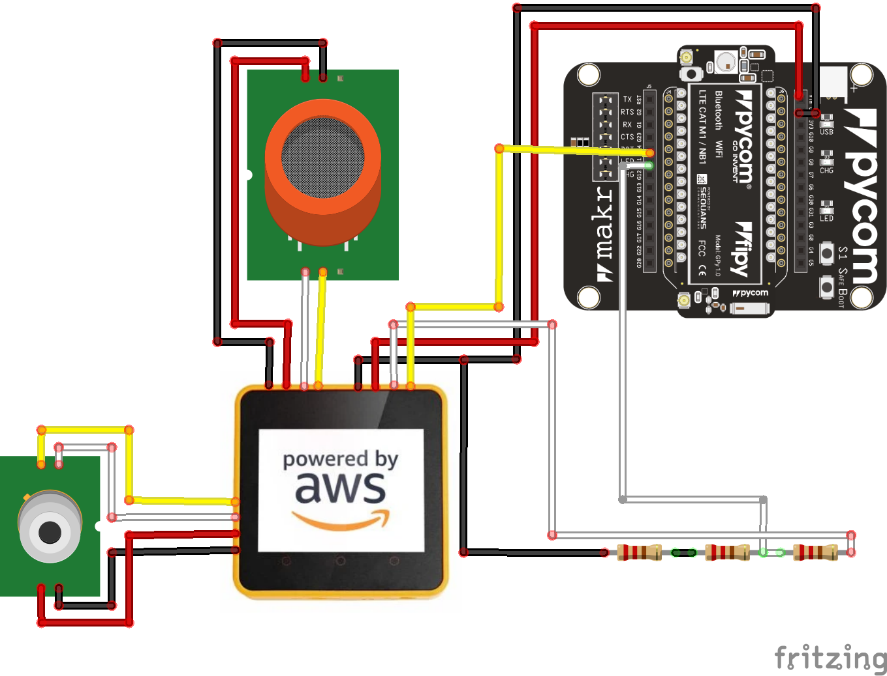

## System Diagram:

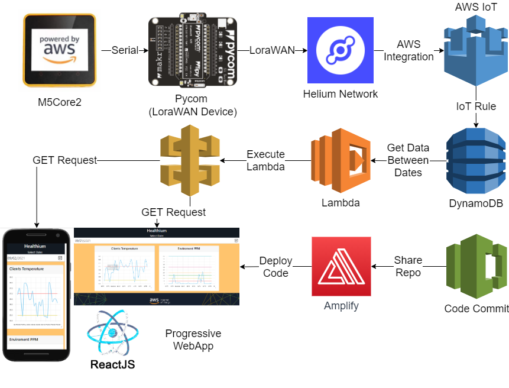

# M5 Core2 AWS Setup:

El M5Core2 es una excelente plataforma de desarrollo de prototipos, en mi caso yo aproveche los puertos grove externos del device para poder conectar los sensores necesarios para el funcionamiento del [System](#hardware-diagram).

| Port   | GPIO PIN     | GPIO PIN     |
| ------ | ------------ | ------------ |
| Port A | GPIO32(SDA)  | GPIO33(SCL)  |
| Port B | GPIO26(DAC)  | GPIO36(ADC)  |
| Port C | GPIO13(RXD2) | GPIO14(TXD2) |

Para mas informacion ir a la documentacion oficial. [Link](https://docs.m5stack.com/en/core/core2_for_aws)

Para programar la placa se utilizo ArduinoIDE.

- Arduino IDE - [Program Link](https://www.arduino.cc/en/software)
- Arduino M5Core2 Library - [Library Link](https://github.com/m5stack/M5Core2)

NOTA: el voltaje de los puertos es de 5v, tener esto en consideracion para la seleccion de modulos y sensores.

## PortA:

A este pin le conecte un sensor MLX90614 el cual funciona mediante I2C.

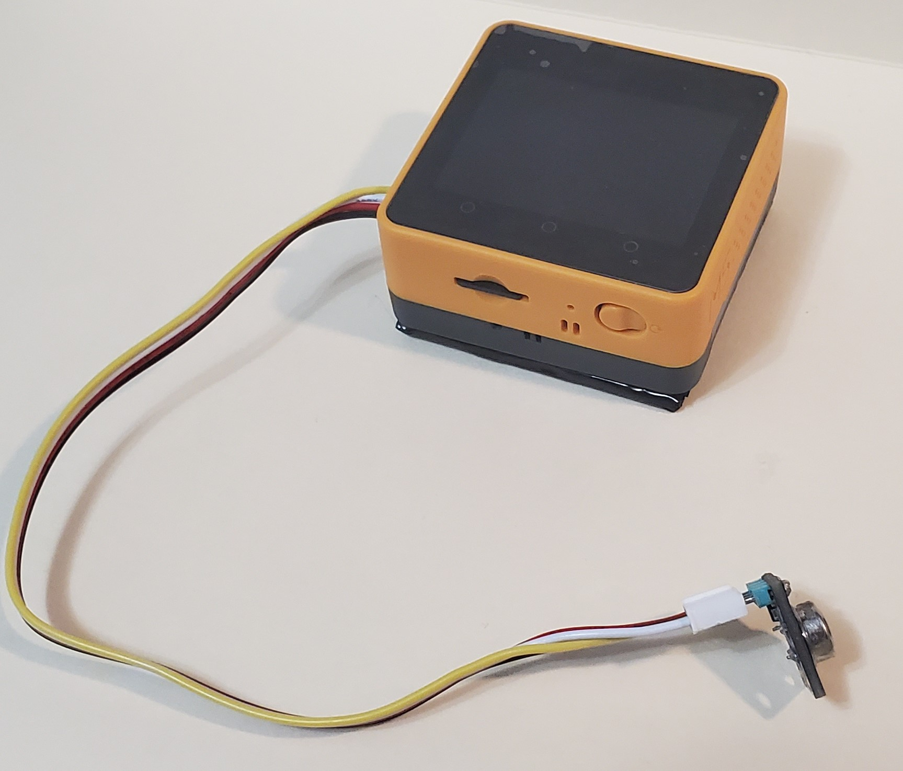

Para el calculo correcto de la temperatura desde la mano se considero la siguiente tabla como refrencia.

To calculate the real temperature of the body, a multivariable linear regression model was performed to obtain an equation that would relate the temperature of the back of the hand and the ambient temperature, to obtain the real internal temperature of the body.

Dentro del codigo esta formula esta programada en la siguiente funcion.

    float correlation(float amb, float skin) {
      if (skin > 27 && skin < 36) {
        float realTemp = 0.71429 * skin - 0.35714 * amb + 23.14286;
        return realTemp;
      }
      return skin;
    }

## PortB:

En este puerto se coloco el sensor MQ135 por su capacidad de medir las PPM en el aire, esto a travez de un valor analogico, sin embargo gracias a ser un modulo economico hay mucha documentacion de como utilizar este sensor correctamente.

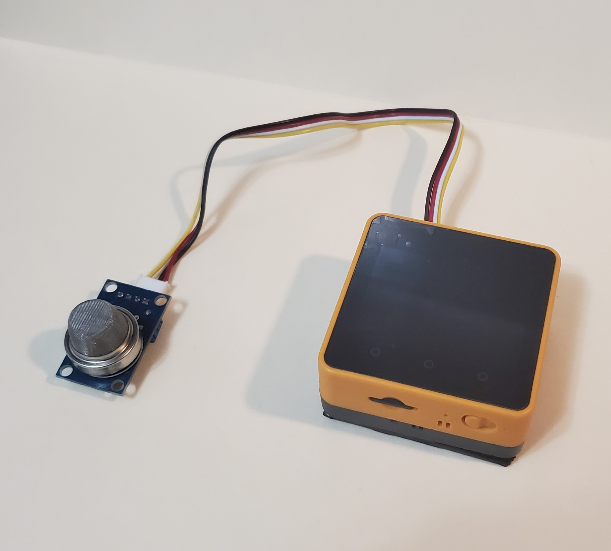

[Docs](https://hackaday.io/project/3475-sniffing-trinket/log/12363-mq135-arduino-library)

La libreria usada para este proyecto es la siguiente, en mi caso utilice esta libreria con Arduino IDE.

[Repository](https://github.com/GeorgK/MQ135)

La parte del codigo que realiza este calculo es la siguiente.

    ...
    #include "MQ135.h"
    ...
    #define RZERO 76.63
    ...
    MQ135 gasSensor = MQ135(36);
    ...
    gSensor = gasSensor.getPPM();

## PortC:

Aqui vamos a conectar el modulo mas importante para el proyecto el cual es el modulo de LoraWAN, realizado en este caso con una Pycom [Fipy](https://pycom.io/product/fipy/) (es posible usar un [Lopy](https://pycom.io/product/lopy4/)).

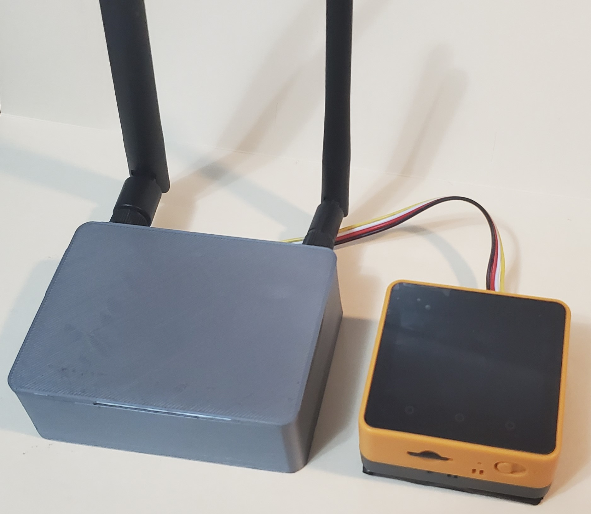

Lo primero que debemos considerar es que este modulo a diferencia de los demas no aguanta 5v en sus puertos digitales, por lo tanto como se muestra en el [System](#hardware-diagram) deberemos hacer un divisor de voltaje para bajar el voltaje de 5v a 3.3, aqui una pequeña simulacion del divisor de voltaje para que quede mas claro su utlilidad.

NOTA: No usar un divisor de voltaje podria dejar daños permanentes en la Fipy/Lopy

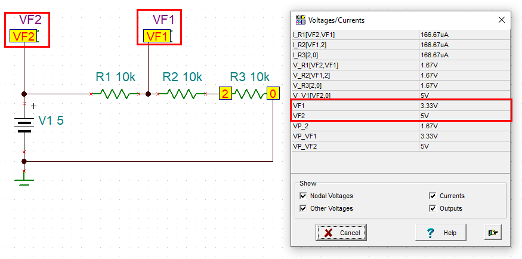

Este circuito lo coloque en una breadboard e hice con el un shield, para evitar fallos en el circuito.

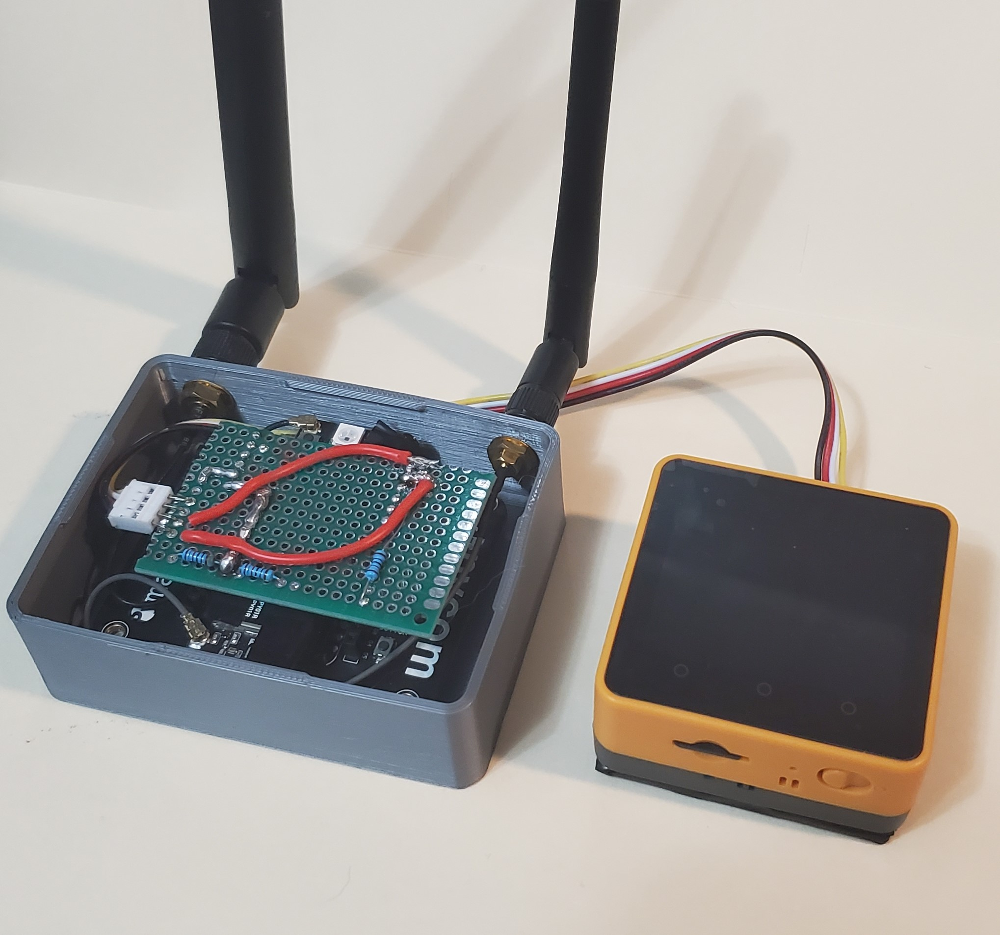

### Fipy Setup:

Ya que cubrimos todas las consideraciones del Hardware, tenemos que configurar el modulo de Fipy para transmitir la informacion mandada desde el M5Core2 a le red LoraWAN de Helium, este se programa con MicroPython, ya que es un lenguaje interpretado y no compilado, flashear el dispositivo es muy rapido.

#### Pymakr:

La herramienta que utiliza Pycom para programar la board es [Pymakr](https://pycom.io/products/supported-networks/pymakr/). En este caso la herramienta requiere de un IDE como lo es [VScode](https://marketplace.visualstudio.com/items?itemName=pycom.Pymakr) o [Atom (Recommended)](https://atom.io/packages/pymakr). La herramienta ya esta completamente automatizada, en cuanto conectas la board, la misma herramienta te conecta a la board mediante el puerto serial.

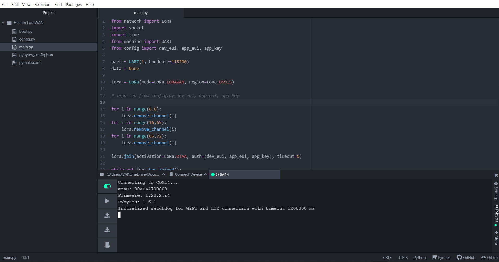

Ahora para que la board funcione y nos permita conetarnos a la red LoraWAN de Helium deberemos obtener las credenciales que muestro a continuacion.

    app_eui = ubinascii.unhexlify('XXXXXXXXXXX')
    app_key = ubinascii.unhexlify('XXXXXXXXXXXXXXXXXXXXXX')
    dev_eui = ubinascii.unhexlify('XXXXXXXXXXX')

Estas credenciales deberemos obtenerlas desde la consola de [Helium](https://console.helium.com/).

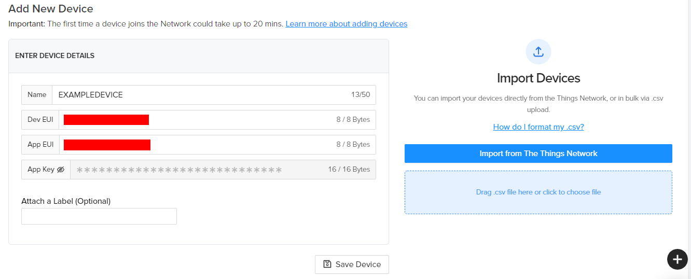

Una vez creamos el device, la plataforma nos dara todos los datos de acceso.

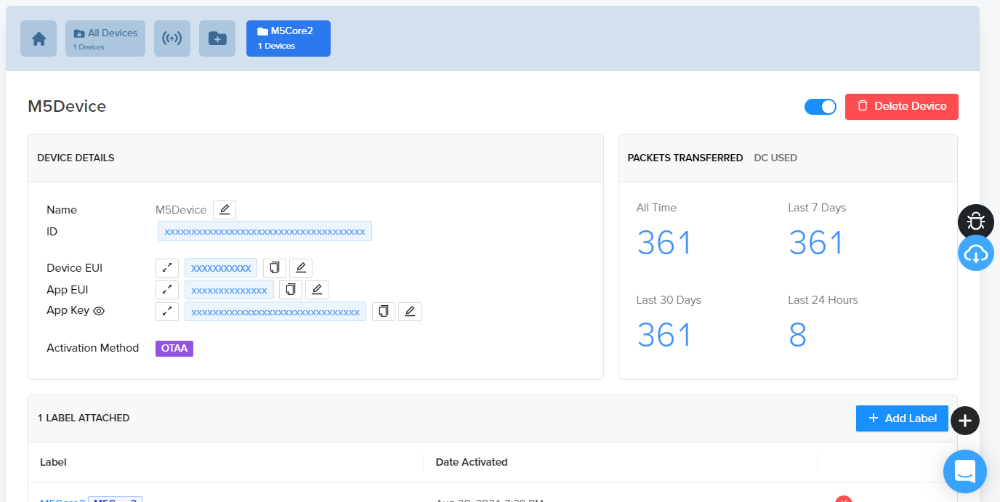

Ahora deberemos colocar las credenciales en el archivo config.py en el codigo de la pycom.

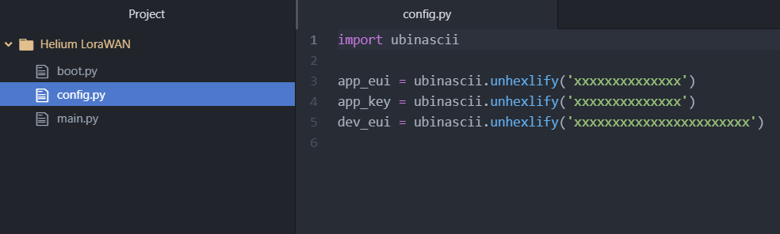

Una vez flasheado el codigo principal tendremos una completa comunicacion serial entre el modulo y el M5Core2.

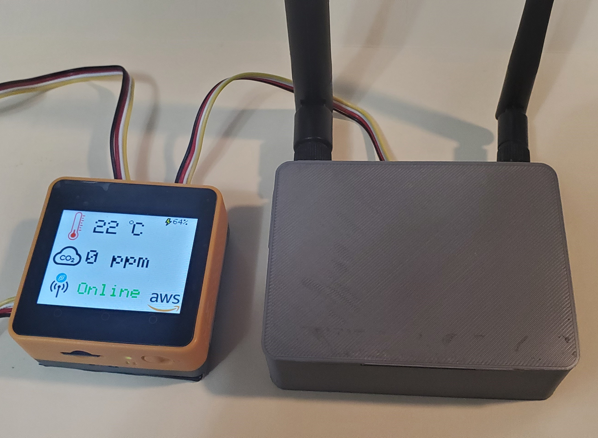

Cuando hay error de comunicacion o el modulo no es detectado nos mandara un mensaje de error.

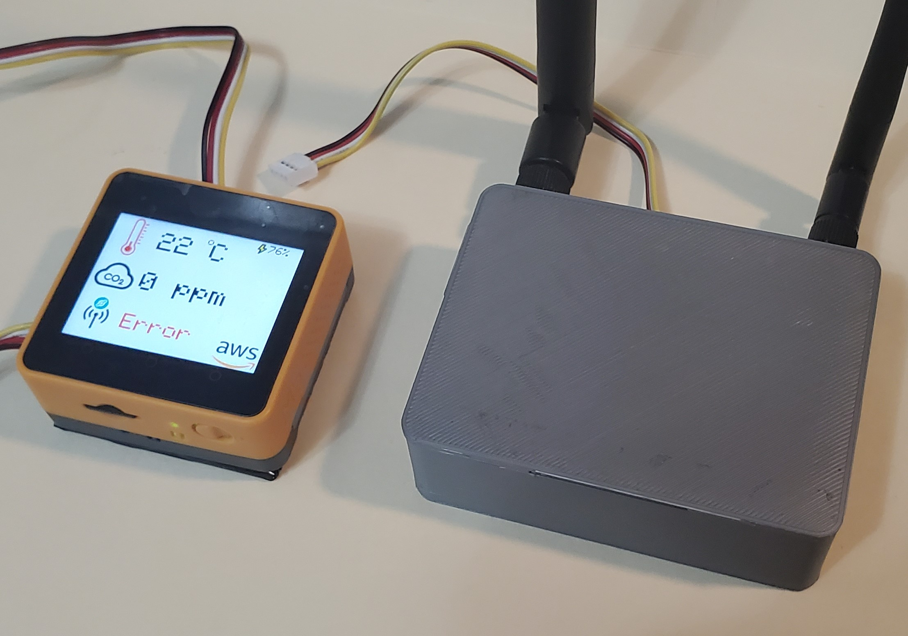

## Results:

Si todo lo anterior lo hemos realizado correctamente en la consola de helium deberemos ver lo siguiente.

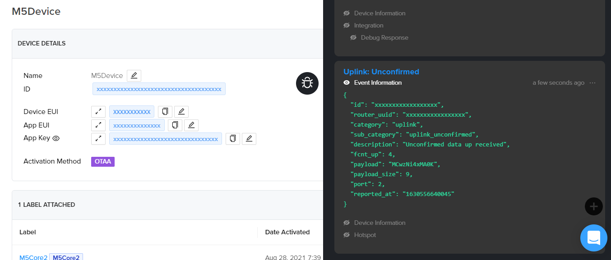

Podemos ver que el payload que llego es una cadena en base64.

    MCwzNi4xMA0K

La decodificacion se tendra que realizar en algun punto, sin embargo el algoritmo para decodificar correctamente esta cadena es el siguiente.

1. Convierte la cadena en base 64 a una cadena hexadecimal
   * 302C33362E31300D0A
2. Convierte la cadena hexadecimal en un arreglo de numeros separando los dos digitos del numero hexadecimal
   * [49, 51, 44, 51, 54, 46, 57, 49, 13, 10]
3. Obten el caracter correspondiente a cada numero.
   * ["1", "3", ",", "3", "6", ".", "9", "1", "\r", "\n"]
4. Convierte el arreglo en una cadena unica.
   * 13,36.91
5. Finalmente separa la cadena en un arreglo con dos valores separados para obtener el valor de ppm y la temperatura.
   * ["0", "36.10"]

Este es el Snippet de codigo para decodificar el mensaje con Javascript, puedes probarlo en cualquier consola de depuracion.

    function base64ToHex(str) {
      const raw = atob(str);
      let result = '';
      for (let i = 0; i < raw.length; i++) {
        const hex = raw.charCodeAt(i).toString(16);
        result += (hex.length === 2 ? hex : '0' + hex);
      }
      return result.toUpperCase();
    }
    function hexStringtoHexArray(str) {
      let result = [];
      for (let i = 0; i < str.length; i += 2) {
        result.push(parseInt(str.substr(i, 2), 16));
      }
      return result;
    }
    function hexArraytoCharArray(arr) {
      let result = [];
      for (let i = 0; i < arr.length; i++) {
        result.push(String.fromCharCode(arr[i]));
      }
      return result;
    }
    function charArraytoString(array) {
      let result = '';
      for (let i = 0; i < array.length; i++) {
        if (array[i] !== '\n' && array[i] !== '\r') {
          result += array[i];
        }
      }
      return result;
    }
    function processing(input) {
      let result = base64ToHex(input);
      result = hexStringtoHexArray(result);
      result = hexArraytoCharArray(result);
      result = charArraytoString(result);
      result = result.split(',');
      return result;
    }
    processing("MCwzNi4xMA0K")

Console Example:

# AWS:

## Helium - AWS IoT Integration:

Ya que los mensajes llegan sin problema a la red e helium, deberemos integrar AWS IoT, para esto deberemos ir a la seccion de Integrations y seleccionar AWS IoT Core.

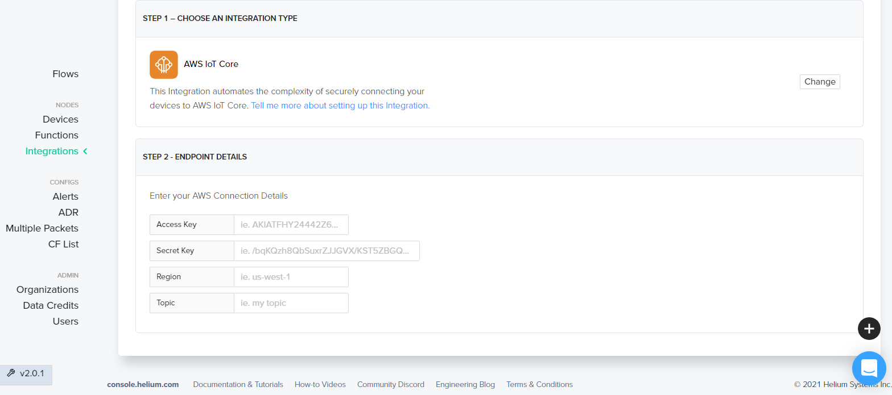

Veremos que las credenciales que nos pide son credenciales de IAM para poder realizar operaciones en AWS sin problema, para esto y por seguridad deberemos crear una credencial IAM la cual solo tenga acceso a los servicios de AWS IoT.

## AWS IAM Creation:

Crearemos un user el cual debera tener programmatic access.

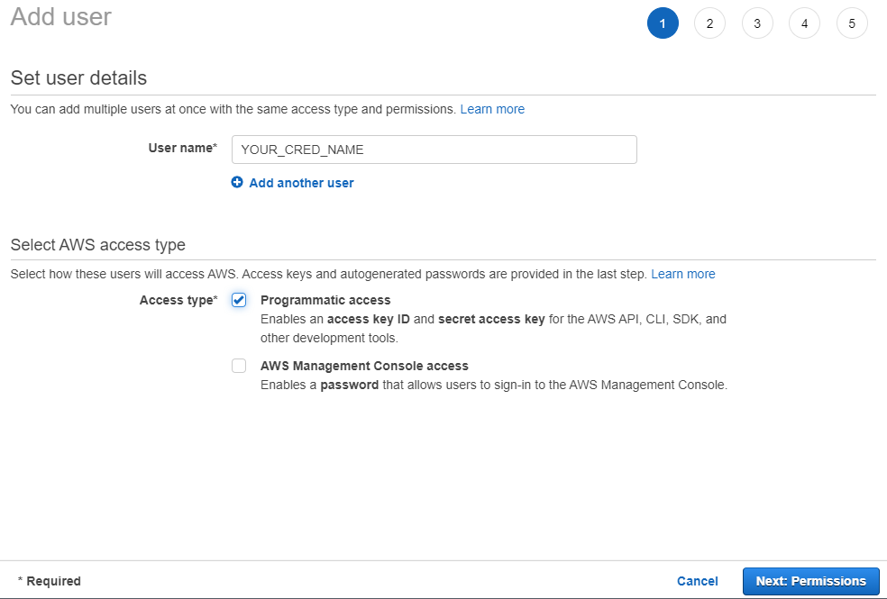

Le agregaremos la policy de poder realizar acciones en AWS IoT.

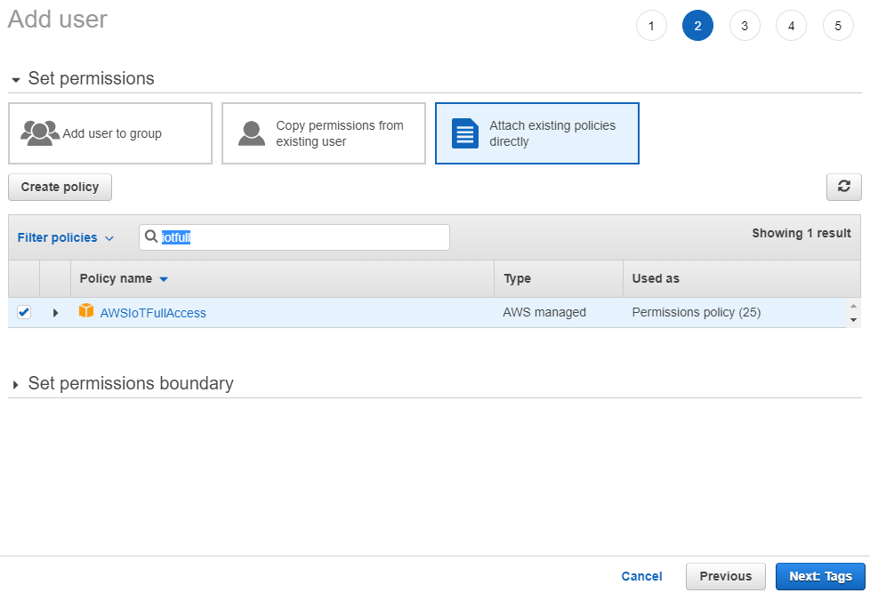

Por ultimo crearemos el usuario.

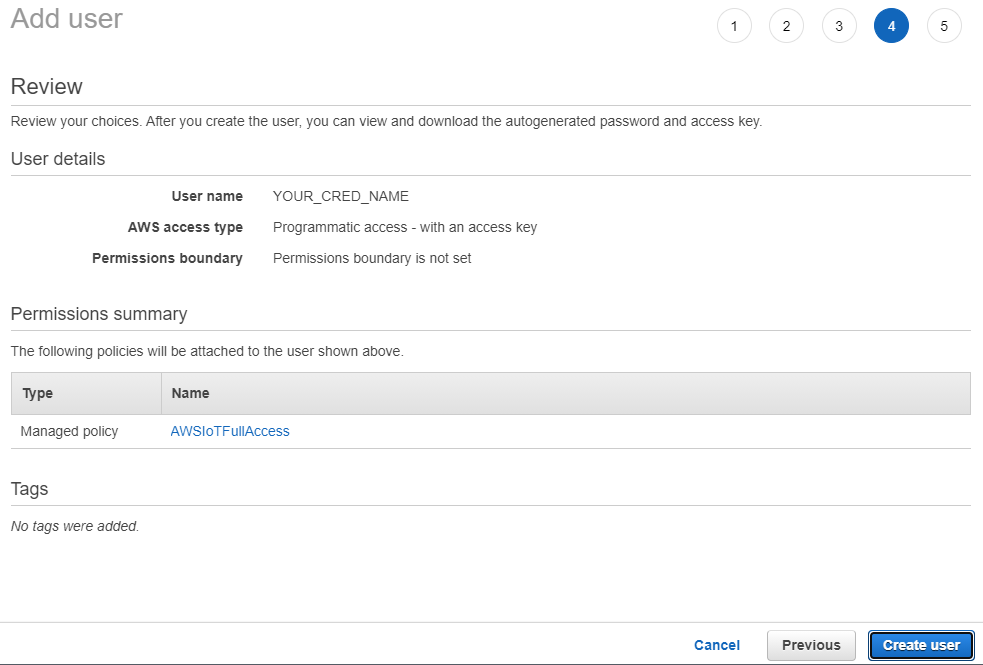

Finalmente nos dara las credenciales que ocupamos para la consola de Helium.

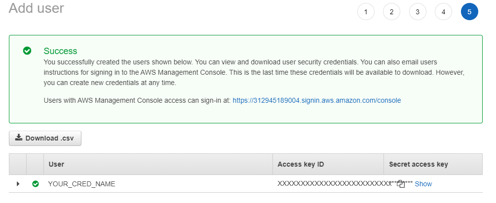

La configuracion que yo ocupe en mi consola fue la siguiente.

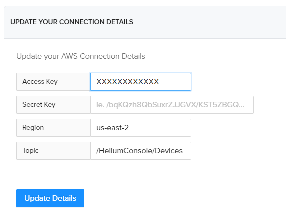

Haciendo una prueba del sistema.

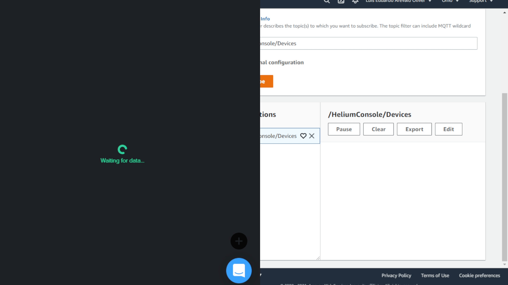

## AWS DynamoDB:

Ahora que los datos estan llegando a AWS IoT debemos de poder almacenarlos de alguna forma, por lo tanto deberemos crear una DynamoDB la cual no servira como almacen de los datos para su posterior despliegue en un dashboard.

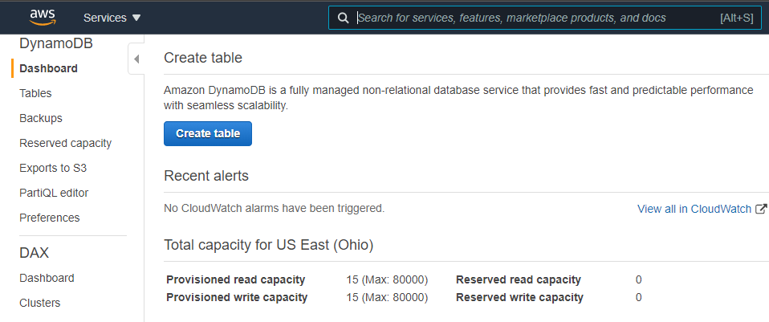

Coloca el nombre que desees a la tabla y no olvides colocarle un Sort Key, esto sera importante para poder realizar un query a la tabla de forma programatica mas adelante.

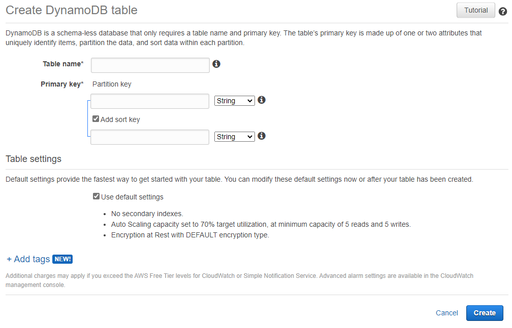

En mi caso utilice como keys Device y Report.

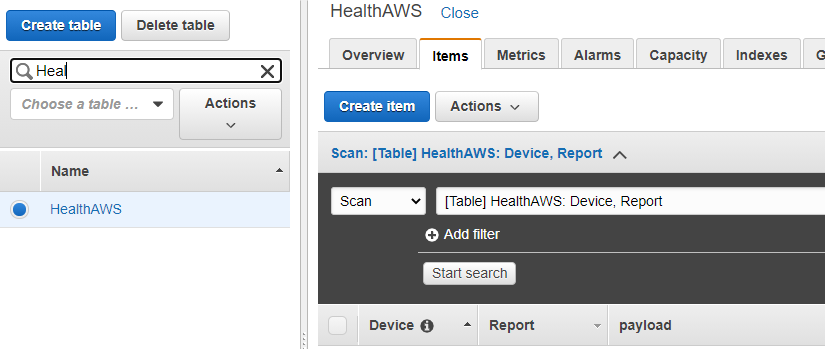

## AWS IoT Rule:

Ya que no tenemos el tiempo para escribir dato por dato en la DynamoDB, cada vez que llega a AWS IoT, deberemos crear un script que reciba los datos de AWS IoT y los mande a DynamoDB de forma programatica, hay muchas forma de hacerlo, sin embargo AWS ya nos creo una herramienta la cual realiza justo esta tarea, da rules.

En la consola de AWS IoT iremos a la seccion señalada para crear nuestra rule

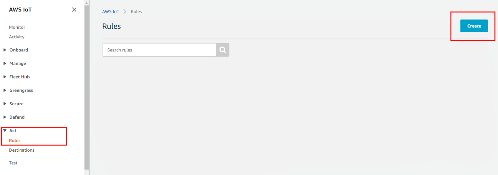

Al crear la rule tendremos que poner atencion al nombre y mas importante al Rule query select, este valor filtrara todos los valores recibidos en AWS IoT y solo nos regresara los que esten en el topic "/HeliumConsole/Devices".

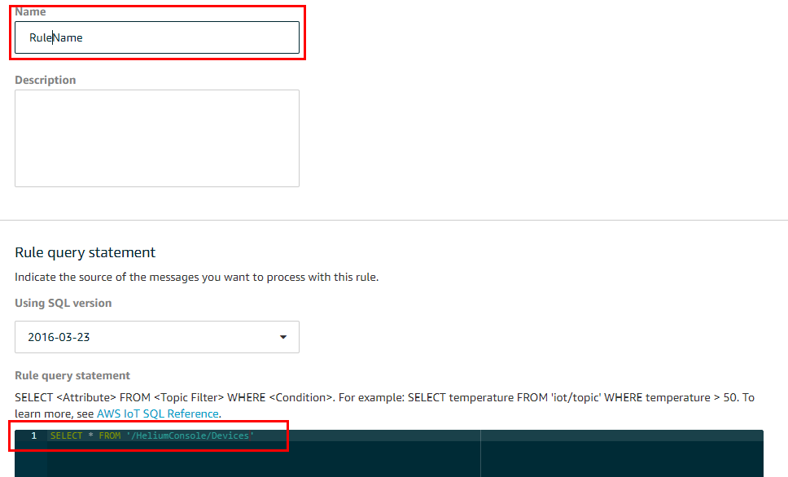

Cuando creamos una rule, debe tener asiciada una action, esta action la seleccionaremos al hacer click en Add action.

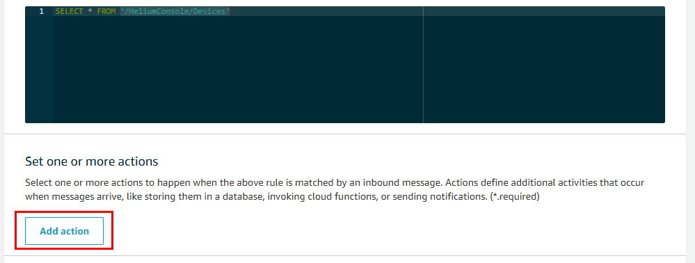

Para este ejemplo usaremos la accion mas simple que es Insert a message into a DynamoDB table.

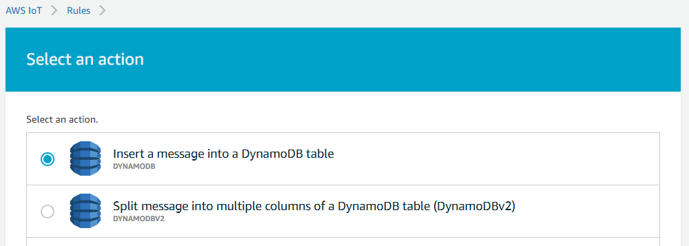

En mi caso la configuracion que usare para que los datos pasen a la DB sera esta.

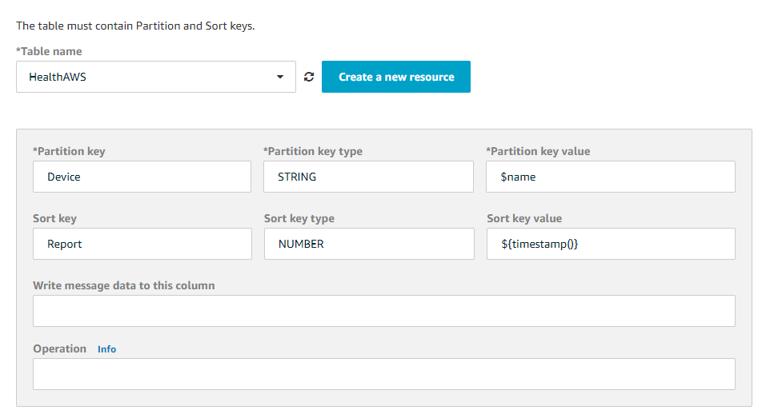

Aqui un ejemplo de como los datos se almacenan en DynamoDB.

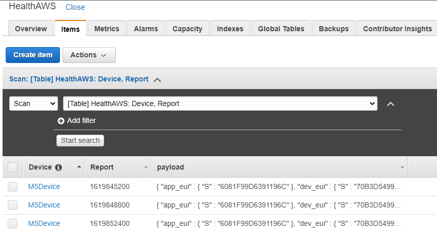

## WebApp:

Ahora ya que tenemos el backend de AWS funcionando y guardando los datos en una DB, tendremos que desplegarlos en algun lado para que esos datos sean de utilidad ya que dato que no es analizando no sirve de nada guardar.

Sientete libre de usar la WebApp y ver el historico del sevice dia con dia.

WebApp: https://master.ds34d9ds0t5rz.amplifyapp.com/

### ReactJS:

Para programar la pagina web se utilizo el framework de ReactJS, todos los archivos fuente estan en la carpeta [WebApp](https://github.com/altaga/Healthium/tree/main/WebApp).

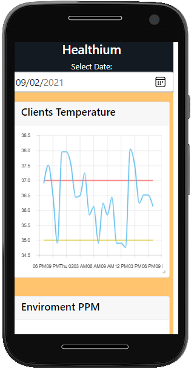

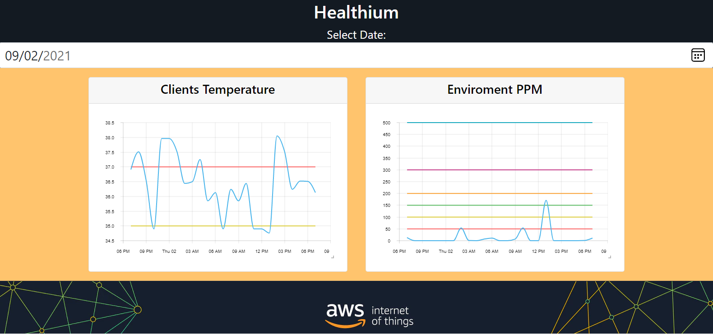

Para poder consumir los datos de la DB en nuestro dashboard deberemos crear una API la cual pueda leer los datos y entrgarnoslos.

### AWS Lambda:

Ya que la DB va a tener muchisimos datos, no tiene sentido llamar todos los datos guardados en ella cada vez que llamamos a la API, por lo tanto sera nacesario realizar un Query de los datos, y como se menciono al crear la DB sera muy util la Sort Key.

    import json
    import boto3
    from boto3.dynamodb.conditions import Key

    dynamodb = boto3.resource('dynamodb')

    def lambda_handler(event, context):
        table = dynamodb.Table("HealthAWS")
        try:
            response = table.query(
                KeyConditionExpression= Key('Device').eq(event["headers"]["device"]) & Key('Report').between(int(event["headers"]["min"]),int(event["headers"]["max"]))
            )
            return(response['Items'])
        except:
            return("Error")

Al colocar la referencia de event["headers"] podremos acceder a los datos que mandemos mediante los headers de la API Request.

### AWS API Gateway:

Ya que podemos llamar a la DB y realizarle un Query debemos de crear una API la cual conecte nuestra WebApp con esta funcion.

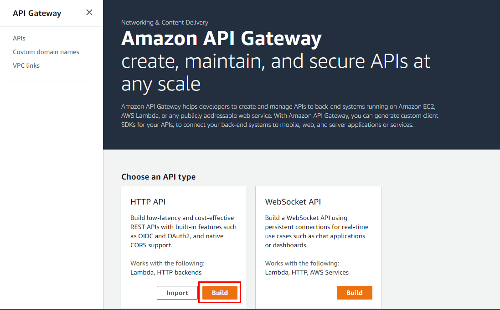

La configuracion inicial de la API integraremos directamente la Lambda desde ahora.

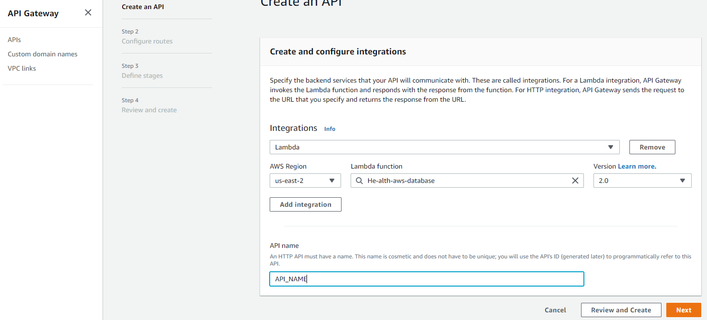

Ahora podemos configurar el resource path, el cual sera el path que pondremos para hacer el request.

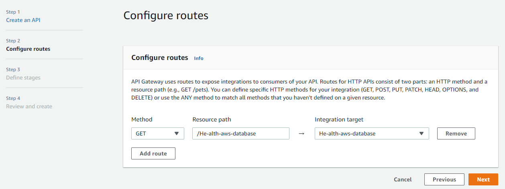

Una vez terminada la configuracion la API debera verse asi.

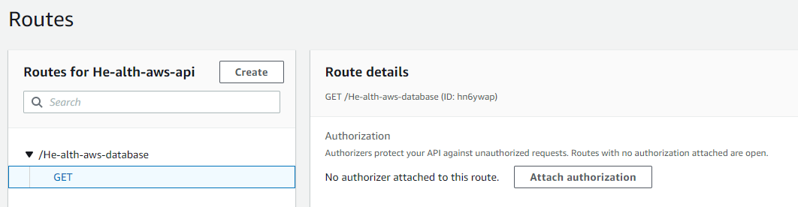

NOTA: Al momento de agregar la integracion de Lambda a nuestra API Gateway, se configurara automaticamente los permisos.

#### Test:

Ya que tenemos nuestra API creada, debemos hacer un request de prueba para revisar que esto funcione.

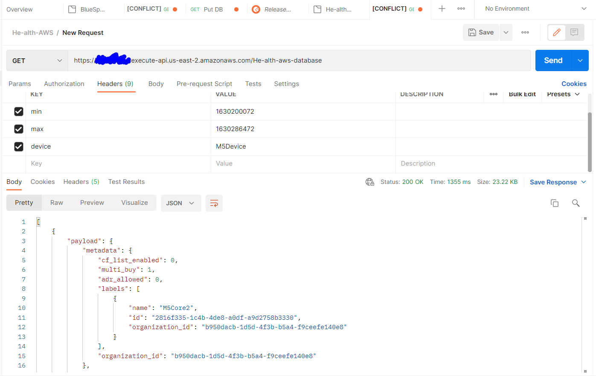

#### CORS:

El Cross-Origin Resource Sharing es un "seguro" el cual nos permite decidir quien puede consumir la api y desde donde, en nuestro caso ya que estamos en un ambiente de produccion deberemos colocar el URL final de nuestra app, para solo permitir que esta consuma la API.

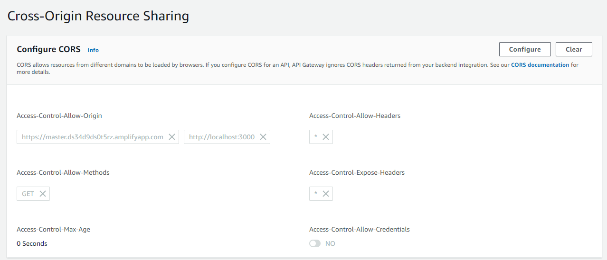

### AWS CodeCommit:

Vamos a usar el servicio de Amplify para hacer el despliegue de nuestra aplicacion, pero este requiere tener un repositorio donde tengamos nuestro codigo para poder relizar el proceso de CI/CD podemos utlizar cualquiera de los siguientes Git repository hosting services.

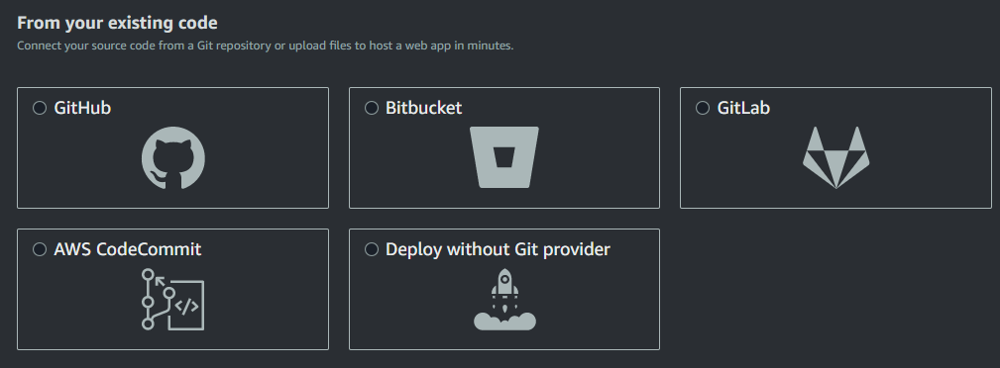

Sin embargo para mantener una mejor organizacion de las apps desplegadas en AWS, usaremos AWS CodeCommit.

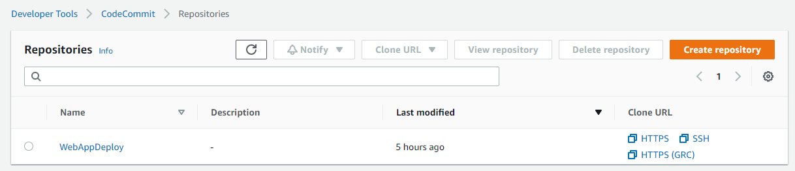

Con este servicio el cual es identico a realizar un push a un repositorio en github, nos permitira mantener el control de versiones de nuestra webapp desde AWS.

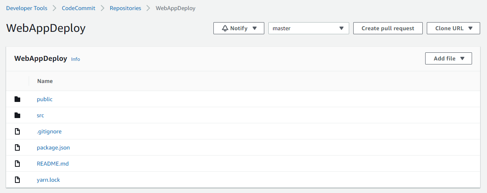

### AWS Amplify:

En este caso como ya se menciono en el paso anterior seleccionaremos AWS CodeCommit.

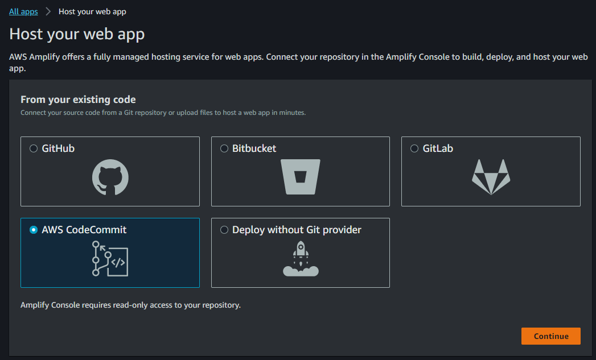

Seleccionamos el repositorio que creamos con nuestro codigo.

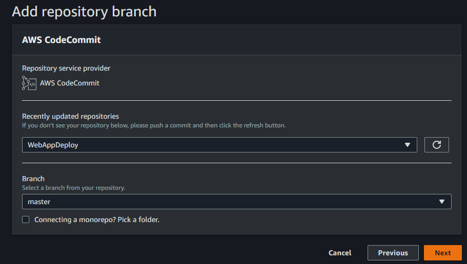

Ya que es un despliegue con ReactJS los ajustes de Build se configuran automaticamente.

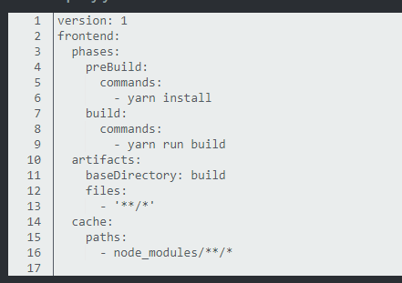

Una vez terminamos de crear la WebApp, nos debera aparecer todos los pasos del ciclo Ci/CD y si todo salio bien deberan verse asi.

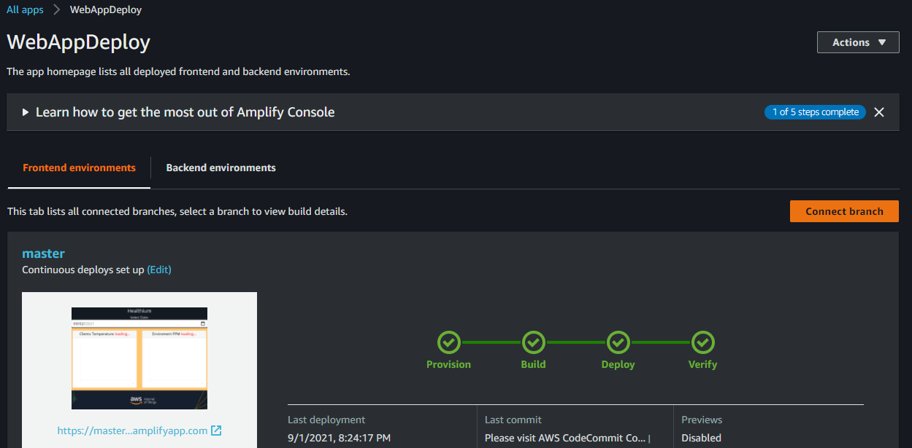

El resultado sera un link parecido a este.

WebPage: WebApp: https://master.ds34d9ds0t5rz.amplifyapp.com/

# Final Product:

## Device:

## WebApp Final:

# EPIC DEMO:

